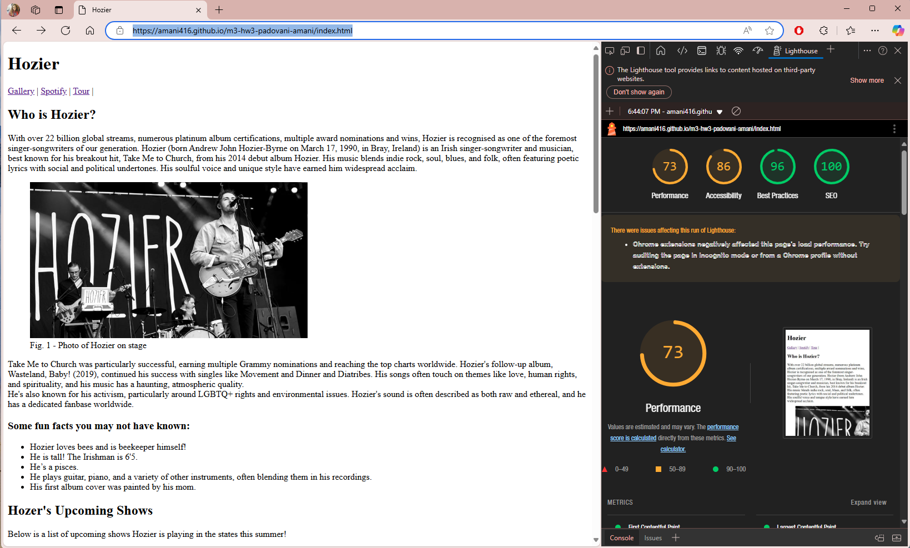
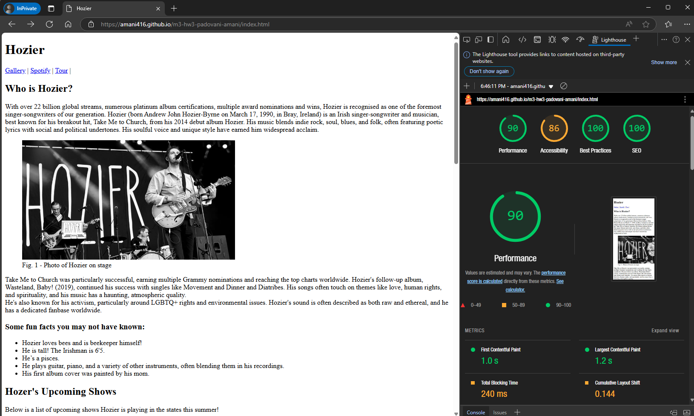
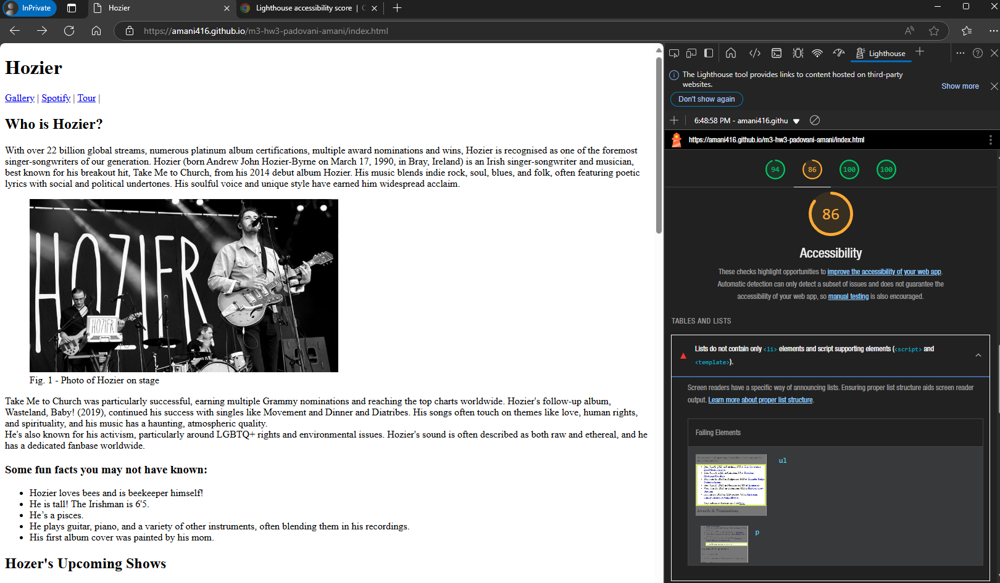

# m3-hw3-padovani-amani
Assignment 3

I ran the lighthouse report on Google three times. The first time it showed that it may perform better if I audited the page in incognito mode or without my Chrome extenstions.

After I ran lighthouse in incognito mode, I realized I was missing a closing list tag. After fixing this and runing the report a third time, the site performed over 90% in all categories.

Pics below:

Created by Amani Padovani (Flood)