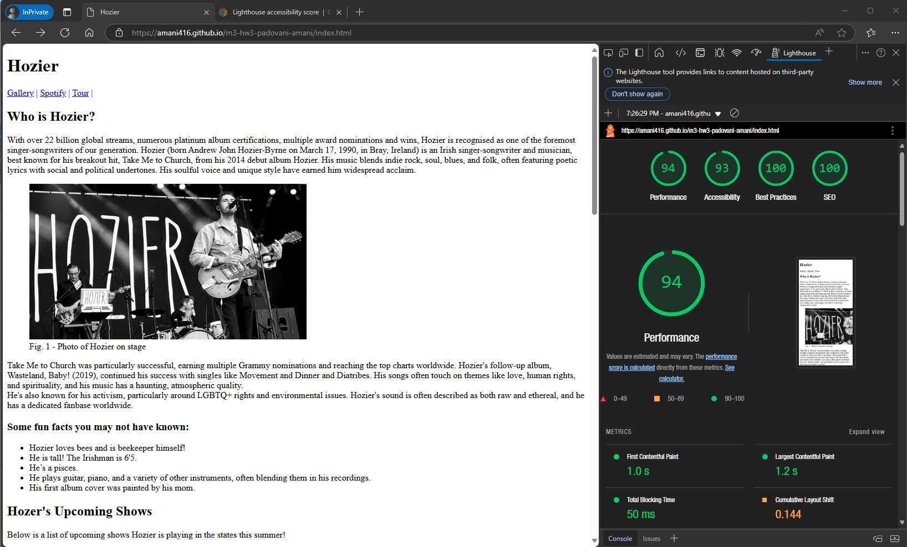

# m3-hw3-padovani-amani
Assignment 3

I ran the lighthouse report on Google three times. The first time it showed that it may perform better if I audited the page in incognito mode or without my Chrome extenstions.

After I ran lighthouse in incognito mode, I realized I was missing a closing list tag. After fixing this and runing the report a third time, the site performed over 90% in all categories.

Pics below:
<figure>
    
    <figcaption>Fig. 1 - First time running the report.</figcaption>
</figure>

<figure>
    
    <figcaption>Fig. 2 - Second time running the report.</figcaption>
</figure>

<figure>
    
    <figcaption>Fig. 3 - Second time running the report, showcasing the missing list tag.</figcaption>
</figure>

<figure>
    
    <figcaption>Fig. 4 - Third and final time running the report.</figcaption>
</figure>

Created by Amani Padovani (Flood)